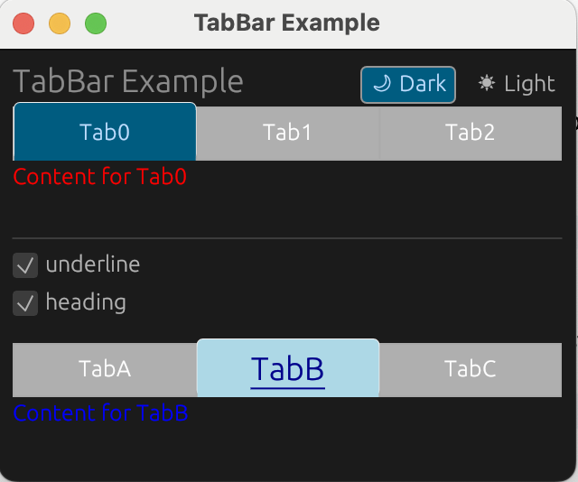
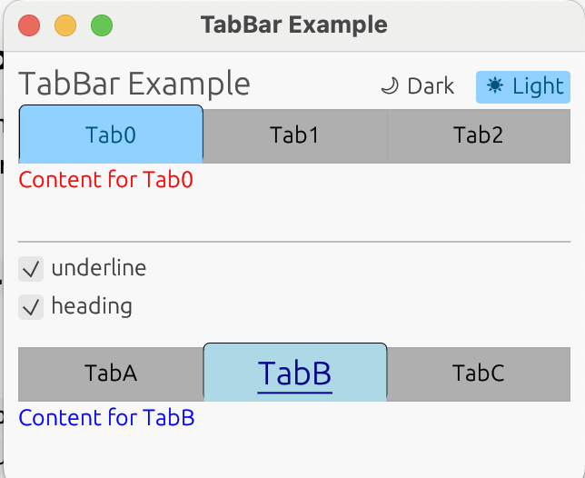

# egui-comps
Additional Components/Widgets for egui

### TabBar
A simple TabBar with some degree of customization. 
Allows to change color aspects and also underline and heading sized text.

Can be used like a standard Widget with
`ui.add(...)` or `ui.add_enabled(...)`

The current tab is in the `selected` variable which must be mutable.

`pub fn new(cols: Vec<String>, selected: &'a mut usize, visuals: &eframe::egui::Visuals) -> Self`

To run the example:
`cargo run --example tabbar_sample`

